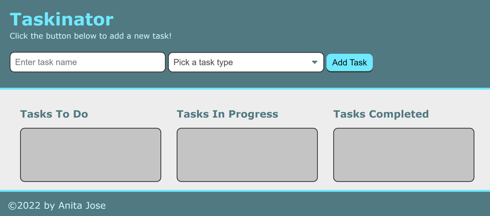

# Taskinator

## Description

Taskinator is a task-tracker application that allows you to create tasks by entering a task name, selecting a type, and clicking an "Add Task" button. Following this, you can organize the tasks into Tasks To Do, Tasks In Progress, and Tasks Completed lists by using the dropdown to change the task status.

The app runs in the browser and features dynamically updated HTML and CSS, powered by JavaScript.

The deployed application can be viewed at: https://anitajose1.github.io/taskinator/

